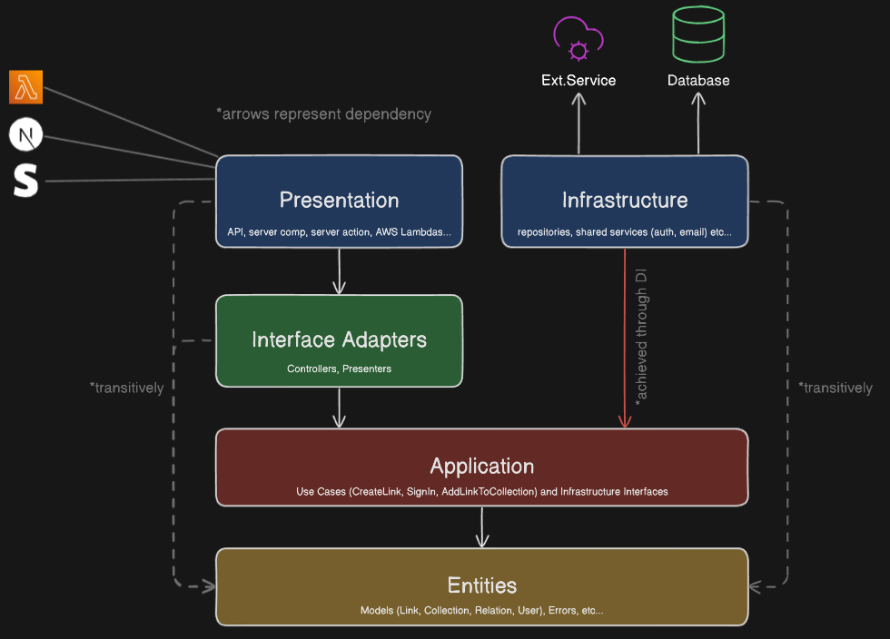
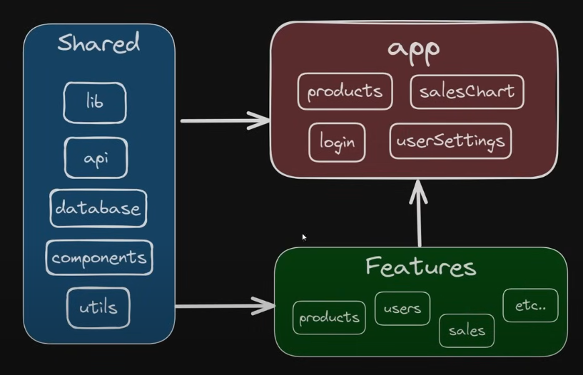

# todo

Yes, that thing. [https://todo.thisjt.me](https://todo.thisjt.me)

## Diary

My first time at strictly implementing clean architecture and feature-sliced design, reflected in the project structure.

## Architecture:

- `presentation`: Hono API Framework.
- `interface`: Processes the request/response from the presentation layer.
- `infrastructure`: Database driver to be used by the application layer.
- `application`: Use cases and business logic.
- `entities`: User and Todo models. In here, we will be using prisma to define the database models.

Source: [Guide on how to implement Clean Architecture in Next.js - Lazar Nikolov](https://www.youtube.com/watch?v=jJVAla0dWJo)

## Feature-Sliced Design:

The folders `featured` and `shared` will be inside the `lib` folder.

- `features`: Each feature will be inside its own folder.
- `shared`: Shared components, hooks, types, utils, etc.
- `routes`: Routing.

Source: [This Folder Structure Makes Me 100% More Productive - Web Dev Simplified](https://www.youtube.com/watch?v=xyxrB2Aa7KE)

## Things to Remember

- `hooks.server.ts` will be used to differentiate between the Hono API and the SvelteKit frontend.
- `load` functions will be used to fetch data for the SvelteKit frontend.
- `actions` will be used to handle form submissions for the SvelteKit frontend.
